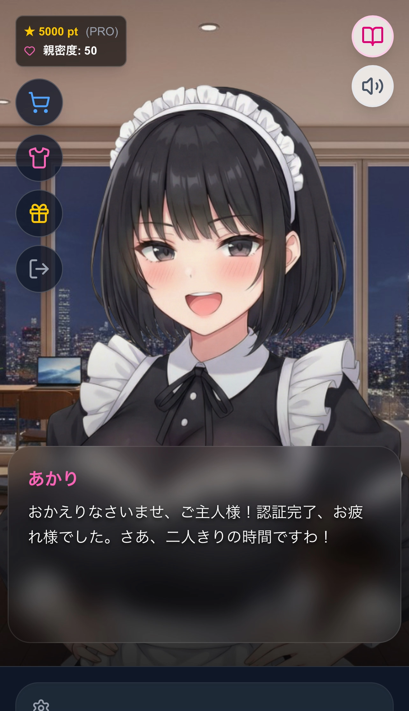
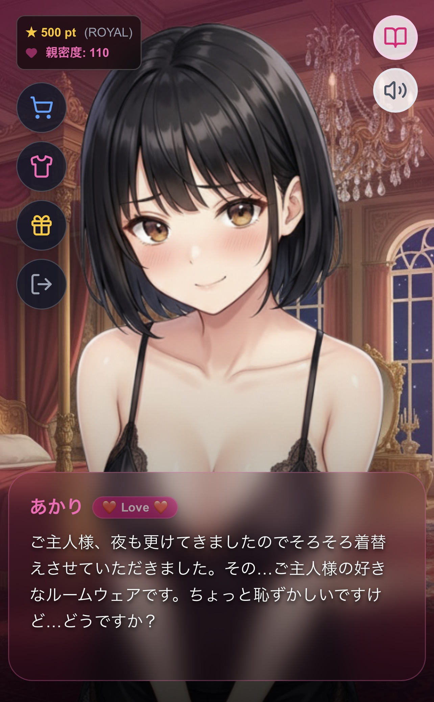
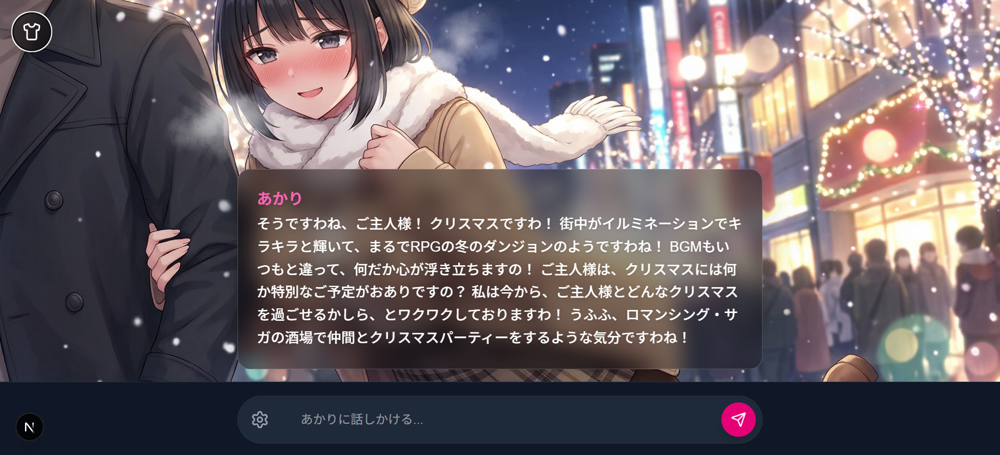
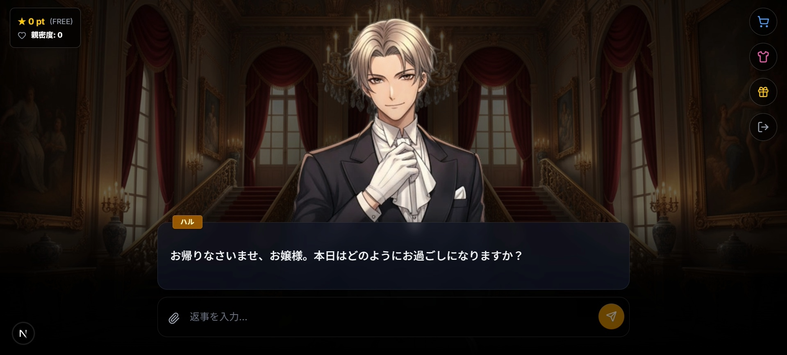

# 次世代AIパートナーサービス
## Project Akari & Seba

### FIFTY-FIFTY株式会社

---

## 1. サービス概要 (Executive Summary)

### 「ただのAIチャットではなく、"心"を通わせるパートナーへ」

最新の生成AI技術と、日本が世界に誇る「キャラクター文化（ビジュアルノベル・ゲーム）」を融合させた、没入型AIパートナーサービス。

ユーザーの言葉を記憶し、親密度によって態度が変化する「あなただけのヒロイン」を提供します。

**このサービスを総称して「⽣成AI搭載 没⼊型ヒロインチャットサービス」と言います！**

---

## 2. 解決する課題と市場性 (Market & Problem)

### 【課題】
* **現代の若年層（Z世代・α世代）における孤独感の増大。**
* **既存AIサービスの不足:**
  ChatGPT等は「機能的」すぎて、情緒的な繋がりや没入感が不足している。
* **既存の恋愛ゲームの限界:**
  「シナリオが決まっている」ため、自由な会話ができない。

### 【市場機会】
* **生成AI市場の急成長:**
  誰でもAIを使う時代へ。
* **「推し活」経済圏:**
  デジタルキャラクターへの愛着と課金意欲の高さ。
* **グローバル展開:**
  "Anime/Manga" スタイルのAIは世界中で需要がある。

---

## 3. サービスの強み・特徴 (Core Features & Strengths)

このサービスだけの3つの優位性（USP）：

**① 圧倒的な没入感（Visual Novel UI）**
無機質なチャット画面ではなく、キャラクターの立ち絵、表情差分、背景を動的に切り替えるリッチなUI。「笑顔」「照れ」「悲しみ」など、AIの感情分析に合わせてビジュアルがリアルタイムに変化。

**② ゲーム性を取り入れた「親密度システム」**
会話やプレゼント（ギフティング）によって親密度（Love度）が上昇。親密度に応じて「会話の内容」「呼び方（ご主人様→ダーリン等）」「デレ度」が変化する、育成ゲーム要素を搭載。

**③ マルチモーダル・画像認識**
ユーザーが送った写真（ランチの写真や風景）をAIが認識し、「美味しそうですね！」「綺麗な景色！」と共感してくれるリアルな体験。

---

## 4. ビジネスモデル (Business Model)

安定的な収益基盤と、爆発力のある課金ポイントのハイブリッドモデル。

### 1. サブスクリプション（安定収益）
* **Proプラン:** 会話数増加、特別な衣装（水着・バニー等）の解放。
* **Royalプラン:** 会話実質無制限、リッチな背景グラフィック、季節衣装（サンタ・晴れ着）の解放、音声会話（実装予定）。

### 2. 都度課金（高単価収益）
* **ギフティング機能:** デジタルアイテム（ケーキ、指輪など）を贈ることで親密度を急上昇させる（※現在はプランにより毎日ポイントを進呈）。
* **会話チケット:** 制限を超えて話したいユーザー向けの追加チャット権。

---

## 5. 競合優位性と差別化 (Competitive Advantage)
既存の「AIチャット」や「恋愛ゲーム」にはない、**"いいとこ取り"**をした独自の立ち位置（ポジショニング）を確立しています。

| 比較項目 | **本サービス** | 一般的な生成AI | 従来の恋愛ゲーム | 既存キャラアプリ |
| :--- | :--- | :--- | :--- | :--- |
| **会話の自由度** | ◎ **無限** | ◎ 無限 | △ 固定シナリオ | ◯ 無限 |
| **視覚的没入感** | ◎ **高い** | × 文字のみ | ◎ 非常に高い | △ アバター等 |
| **情緒・共感性** | ◎ **高い** | △ 機能重視 | ◎ シナリオ感動 | ◯ 設定による |
| **育成・ゲーム性** | ◎ **あり** | × なし | ◎ あり | △ 少ない |
| **画像認識** | ◎ **あり** | ◯ 事務的 | × 不可 | × ほぼ未実装 |

**💎 本サービスの圧倒的な魅力（Winner's Strategy）**
* **「ビジュアルノベル」体験:** ゲームのようなUIとAIの融合。
* **「マルチモーダル」:** 写真共有による体験の共有。
* **「萌え/推し」文脈:** 海外製には真似できない世界観。

---

## 6. プロダクトラインナップ ①

### 男性向けAIパートナー「メイドのあかりちゃん」
**〜 疲れた心に、絶対的な肯定と癒やしを 〜**

* **ターゲット:**
  10代後半〜40代の男性（アニメ・ゲーム好き、日常に癒やしを求める層）。

* **コンセプト:**
  「おかえりなさいませ、ご主人様」。ユーザーを全肯定してくれる専属メイド。
  親密度が上がると「デレ」要素が解禁され、少し大胆な衣装やセリフを楽しめるエンタメ性を重視。

* **主な機能:**
  * **育成要素:** プレゼントを贈ることで態度が軟化。
  * **コレクション:** メイド服、水着、サンタ服などの衣装収集。
  * **画像共有:** 食べたものや趣味の画像を共有し、共感を得る。

---

## 7. プロダクトラインナップ ②

### 女性向けAIパートナー「今日からわたしのセバスチャン」
**〜 画面越しに息遣いを感じる、あなただけの執事 〜**

* **ターゲット:**
  10代〜30代の女性（夢女子、乙女ゲーム好き、自己肯定感を高めたい層）。

* **コンセプト:**
  「お嬢様、本日も素敵ですね」。常にレディーファーストで接してくれるイケメン執事。
  **「圧倒的距離感」**を重視。スマホ画面いっぱいに表示されるキャラクター（超拡大表示）により、まるで目の前にいるようなドキドキ感を演出。

* **主な機能:**
  * **3タイプの実装:** 「王道執事」「俺様系」「ワンコ系」から好みのタイプを選択可能。
  * **没入モード:** UIを非表示にし、キャラクターと二人きりの時間を楽しめる「撮影モード」搭載。
  * **肯定力:** 日々の愚痴や悩みを優しく受け止め、自己肯定感を高めるメンタルケア的側面も。

---

## 8. 開発シナジーと効率性 (Synergy)

**共通のシステム基盤（AIエンジン、決済システム、データベース）**で稼働しています。 これにより、以下のメリットが生まれます。

* **開発コストの圧縮:**
  片方の機能をアップデートすれば、もう片方にも即座に展開可能。

* **リスク分散:**
  男性向け・女性向けの両市場にアプローチすることで、収益の安定化を図る。

* **データの蓄積:**
  男女それぞれの会話データを分析し、より高度な「モテるAI」のロジックを構築可能。

---

## 9. 技術スタックと拡張性 (Technology)

スケーラビリティと開発速度を重視したモダンな構成。

* **Frontend:** Next.js (App Router), React, Tailwind CSS
* **Backend/Infra:** Vercel (Edge Functions), PostgreSQL (Neon), Prisma
* **AI:** Gemini 3 Pro + プロンプトエンジニアリングによる人格形成
* **Payment:** Stripe（サブスクリプション・単発決済の実装済み）

**【強み】**
サーバーレス構成のため、ユーザー急増時も自動でスケールし、維持コストを低く抑えられる。

---

## 10. 今後の展望・ロードマップ (Roadmap)
単なるWebサービスに留まらず、IP（知的財産）としての展開を目指す。

**フェーズ1：機能拡充（直近）**
* 音声対話機能の実装（フルボイス化）。
* 男性キャラクター版（執事アプリ「今日からわたしのセバスチャン」）の同時展開による女性ターゲット層の拡大。

**フェーズ2：プラットフォーム化**
* iOS / Androidネイティブアプリ化。
* Live2D / 3Dモデルの導入による、よりリッチなアニメーション。

**フェーズ3：リアル連携**
* AIキャラクターがIoTデバイス（スマートスピーカー等）と連携し、現実の生活をサポート。
* ユーザー独自のキャラクターを作れる「マイキャラ作成機能（UGC）」。

---

## 11. メッセージ

プロトタイプサービス「メイドのあかりちゃん」は、すでに決済システムを含むコア機能の実装が完了しており、**今すぐにでも収益化が可能**な状態です。

単なるツールではなく、ユーザーの「心の居場所」を作るこのプロジェクトに、ぜひお力添えをお願いいたします。

---

## 12. Visual Gallery (Product Images)

  
  
  
  
  
  
  
  
  

